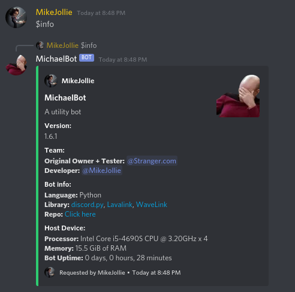
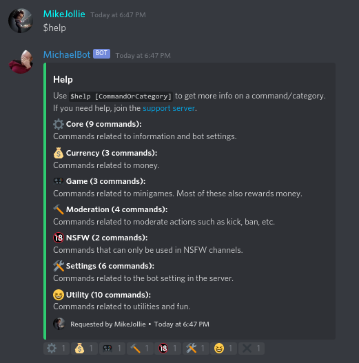
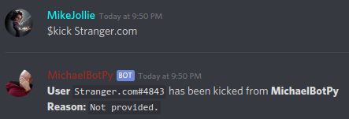
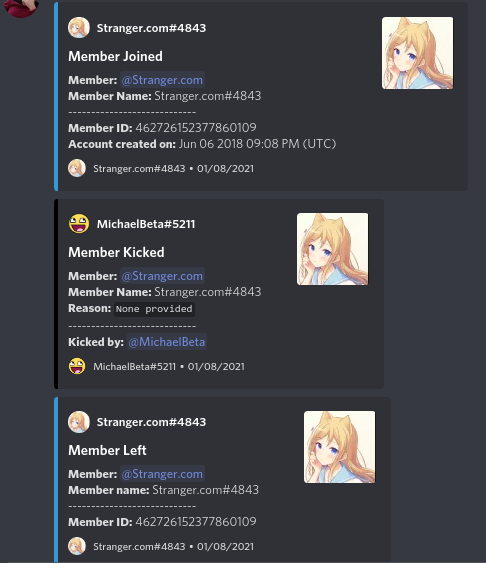
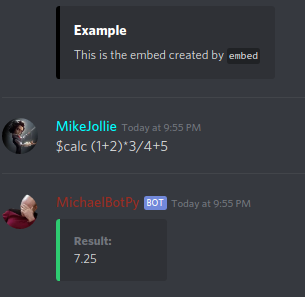
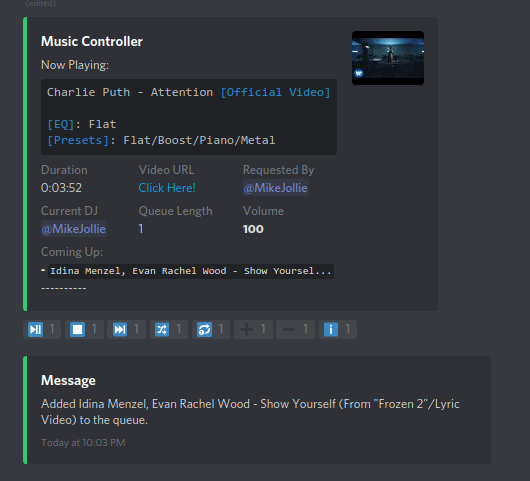
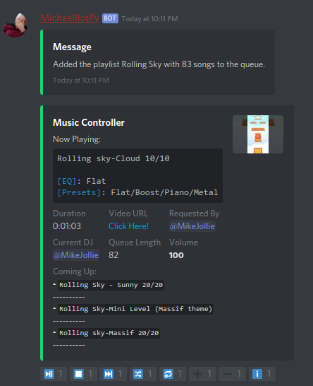
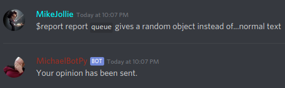

# MichaelBotPy

MichaelBotPy is a bot written in Python using [discord py](https://github.com/Rapptz/discord.py).

The reason why this bot exist is because...I'm free, and I like to make one.

Join the [support server](https://discord.gg/jeMeyNw) to get help.

## Features

- Basic information

- Interactive help menu

- Detailed command description

- Moderation commands

- Detailed logging

- Fun commands

- Utility commands

- Warm welcome messages

- Interactive music menu

- Support playlist

- Report and suggest features

- And the best thing is...all features are free-guaranteed.

  - Features like changing volume in Rythm is absolutely pennyless in this bot (meaning you don't have to pay to use this).

## Limitations

- Not bug-free ie. a lot of bugs.
- No support for multi-server yet.
- Uptime not 24/7.

## Development notes

- To run the bot, run the file `DiscordBot.py`.
- To edit categories, look into `categories` folder.
- Do not alter `data` without reasonable reason to do so.

## License

This project is under the [MIT LICENSE](https://github.com/MikeJollie2707/MichaelBotPy/blob/master/LICENSE).

## Contributing

You can contribute to this bot via:

- Development: Name your branch `<yourname>-<the objective of the branch>-<maybe with space>`
- Testing: use commands, do actions and report via the `report` command.

## TODO

- [ ] Find a database
- [ ] Fix permission in `core.py`
- [ ] Add stricter error handlers
- [ ] Fix permission in `server.py`
- [ ] Fix some permissions in `utility.py`
- [ ] Fix major error handlers in `moderation.py`
